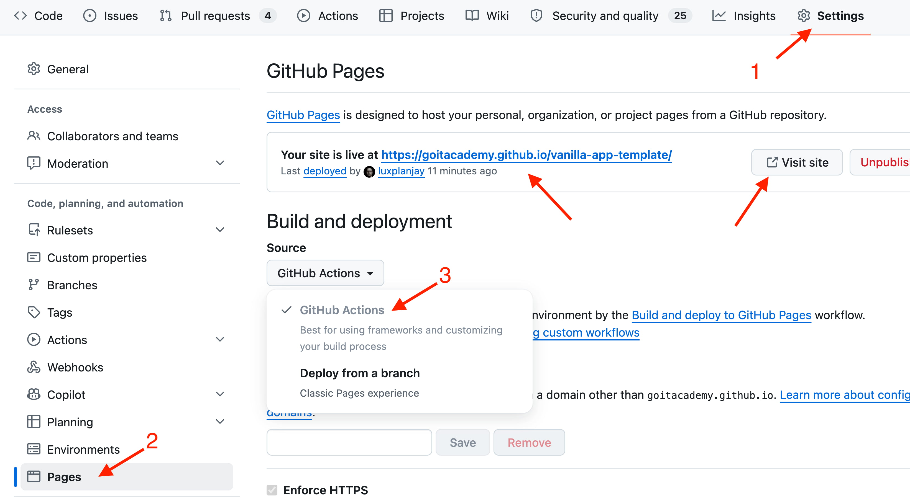
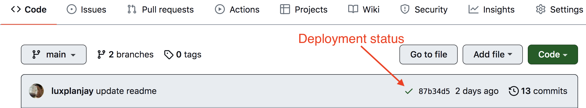
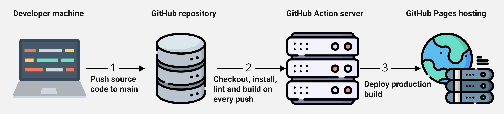

# Vanilla App Template

> Цей шаблон призначений для **командних проєктів**. Домашні завдання виконуються в окремій збірці.

Цей проект було створено за допомогою Vite. Для знайомства та налаштування
додаткових можливостей [звернись до документації](https://vitejs.dev/).

## Створення репозиторію за шаблоном

Використовуй цей репозиторій як шаблон для створення репозиторію свого проекту.
Для цього натисни на кнопку `«Use this template»` і обери опцію
`«Create a new repository»`, як показано на зображенні.

На наступному етапі відкриється сторінка створення нового репозиторію. Заповни
поле його імені, переконайся, що репозиторій публічний, після чого натисни
кнопку `«Create repository from template»`.

Після того, як репозиторій буде створено, увімкни для нього GitHub Pages:
перейди в `Settings` > `Pages` і в секції `Build and deployment` вибери `Source`
→ `GitHub Actions`. Це єдине одноразове налаштування.

Тепер у тебе є особистий репозиторій проекту, зі структурою файлів та папок
репозиторію-шаблону. Далі працюй з ним, як з будь-яким іншим особистим
репозиторієм, клонуй його собі на комп'ютер, пиши код, роби коміти та відправляй
їх на GitHub.

## Підготовка до роботи

1. Переконайся, що на комп'ютері встановлено LTS-версію Node.js.
   [Скачай та встанови](https://nodejs.org/en/) її якщо необхідно.
2. Встанови базові залежності проекту в терміналі командою `npm install`.
3. Запусти режим розробки, виконавши в терміналі команду `npm run dev`.
4. Перейдіть у браузері за адресою
   [http://localhost:5173](http://localhost:5173). Ця сторінка буде автоматично
   перезавантажуватись після збереження змін у файли проекту.

## Файли і папки

- Свій JavaScript пиши у `src/main.js` та інших файлах, які створиш за потреби.
- Файли розмітки компонентів сторінки повинні лежати в папці `src/partials` та
  імпортуватись до файлу `index.html`. Наприклад, файл з розміткою хедера
  `header.html` створюємо у папці `partials` та імпортуємо в `index.html`.
- Файли стилів повинні лежати в папці `src/css` та підключатися до HTML-файлів
  сторінок. Наприклад, `index.html` підключає `./css/styles.css`.
- Зображення додавай до папки `src/img`. Збирач оптимізує їх, але тільки при
  деплої продакшн версії проекту. Все це відбувається у хмарі, щоб не
  навантажувати твій комп'ютер, тому що на слабких компʼютерах це може зайняти
  багато часу.

## Деплой

Жива версія сторінки оновлюється автоматично: щоразу, коли ти змінюєш файли
проекту й відправляєш зміни на GitHub у гілку `main` (прямим пушем або через
прийнятий пул-реквест), проект сам перезбирається й публікується на GitHub Pages.

### Статус деплою

Статус деплою крайнього коміту відображається іконкою біля його ідентифікатора.

- **Жовтий колір** - виконується збірка та деплой проекту.
- **Зелений колір** - деплой завершився успішно.
- **Червоний колір** - під час збірки чи деплою сталася помилка.

Більш детальну інформацію про статус можна переглянути натиснувши на іконку, і в
вікні, що випадає, перейти за посиланням `Details`.

### Жива сторінка

Через якийсь час, зазвичай кілька хвилин, живу сторінку можна буде подивитися за
адресою, вказаною на вкладці `Settings` > `Pages` в налаштуваннях твого
репозиторію. Для прикладу, ось посилання на живу версію цього репозиторію-шаблону —
у тебе буде своє:

[https://goitacademy.github.io/vanilla-app-template/](https://goitacademy.github.io/vanilla-app-template/).

Якщо відкриється порожня сторінка, перевір, що GitHub Pages увімкнено
(`Settings` > `Pages`), а останній деплой у вкладці `Actions` завершився
успішно (зелений).

## Як це працює

Під капотом: після пуша в `main` запускається GitHub Action із
`.github/workflows/deploy.yml`, який збирає проект і публікує його на GitHub
Pages. Якщо щось пішло не так — деталі у вкладці `Actions`.
