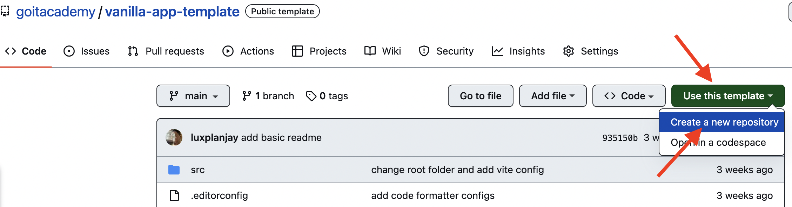
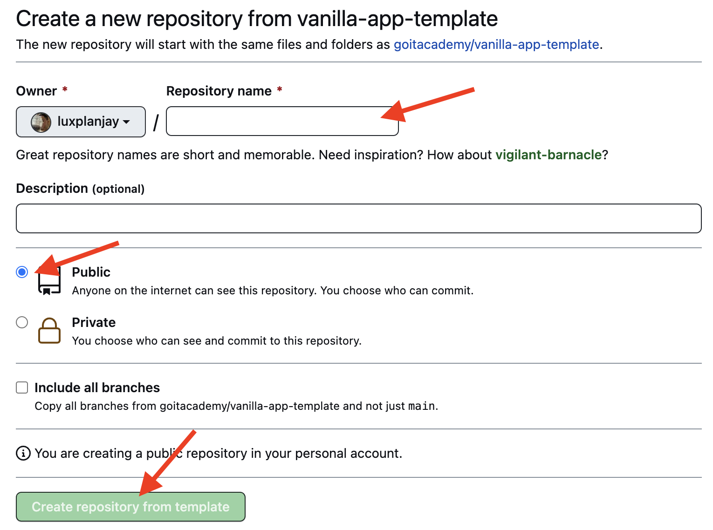
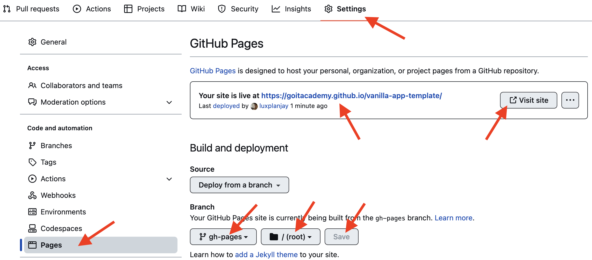

# Vanilla App Template

Этот проект был создан при помощи Vite. Для знакомства и настройки
дополнительных возможностей [обратись к документации](https://vitejs.dev/).

## Создание репозитория по шаблону

Используй этот репозиторий организации GoIT как шаблон для создания репозитория
своего проекта. Для этого нажми на кнопку `«Use this template»` и выбери опцию
`«Create a new repository»`, как показано на изображении.



На следующем шаге откроется страница создания нового репозитория. Заполни поле
его имени, убедись, что репозиторий публичный, после чего нажми кнопку
`«Create repository from template»`.



После того как репозиторий будет создан, необходимо перейти в настройки
созданного репозитория на вкладку `Settings` > `Actions` > `General` как
показано на изображении.


Проскролив страницу до самого конца, в секции `«Workflow permissions»` выбери
опцию `«Read and write permissions»` и поставь галочку в чекбоксе. Это
необходимо для автоматизации процесса деплоя проекта.


Теперь у тебя есть личный репозиторий проекта, со структурой файлов и папок
репозитория-шаблона. Далее работай с ним, как с любым другим личным репозиторием,
клонируй его себе на компьютер, пиши код, делай коммиты и отправляй их на
GitHub.

## Подготовка к работе

1. Убедись что на компьютере установлена LTS-версия Node.js.
   [Скачай и установи](https://nodejs.org/en/) её если необходимо.
2. Установи базовые зависимости проекта в терминале командой `npm install`.
3. Запусти режим разработки, выполнив в терминале команду `npm run dev`.
4. Перейди в браузере по адресу [http://localhost:5173](http://localhost:5173).
   Эта страница будет автоматически перезагружаться после сохранения изменений в
   файлах проекта.

## Файлы и папки

- Файлы стилей должны лежать в папке `src/css` и импортироваться в HTML-файлы
  страниц. Например, для `index.html` файл стилей называется `index.scss`.
- Изображения добавляй в папку `src/img`. Сборщик оптимизирует их, но только при
  деплое продакшн версии проекта. Все это происходит в облаке, чтобы не
  нагружать твой компьютер, так как на слабых машинах это может занять много
  времени.

## Деплой

Продакшн версия проекта будет автоматически собираться и деплоиться на GitHub
Pages, в ветку `gh-pages`, каждый раз когда обновляется ветка `main`. Например,
после прямого пуша или принятого пул-реквеста. Для этого необходимо в файле
`package.json` изменить значение флага `--base=/<REPO>/`, для команды `build`,
заменив `<REPO>` на название своего репозитория, и отправить изменения на
GitHub.

```json
"build": "vite build --base=/<REPO>/",
```

Далее необходимо зайти в настройки GitHub-репозитория (`Settings` > `Pages`) и
выставить раздачу продакшн версии файлов из папки `/root` ветки `gh-pages`, если
это небыло сделано автоматически.



### Статус деплоя

Статус деплоя крайнего коммита отображается иконкой возле его идентификатора.

- **Желтый цвет** - выполняется сборка и деплой проекта.
- **Зеленый цвет** - деплой завершился успешно.
- **Красный цвет** - во время линтинга, сборки или деплоя произошла ошибка.

Более детальную информацию о статусе можно посмотреть кликнув по иконке, и в
выпадающем окне перейти по ссылке `Details`.


### Живая страница

Через какое-то время, обычно пару минут, живую страницу можно будет посмотреть
по адресу указанному на вкладке `Settings` > `Pages` в настройках репозитория.
Например, вот ссылка на живую версию для этого репозитория
[https://goitacademy.github.io/vanilla-app-template/](https://goitacademy.github.io/vanilla-app-template/).

Если открывается пустая страница, убедись что во вкладке `Console` нет ошибок
связанных с неправильными путями к CSS и JS файлам проекта (**404**). Скорее
всего у тебя неправильное значение флага `--base` для команды `build` в файле
`package.json`.

## Как это работает


1. После каждого пуша в ветку `main` GitHub-репозитория, запускается специальный
   скрипт (GitHub Action) из файла `.github/workflows/deploy.yml`.
2. Все файлы репозитория копируются на сервер, где проект инициализируется и
   проходит линтинг и сборку перед деплоем.
3. Если все шаги прошли успешно, собранная продакшн версия файлов проекта
   отправляется в ветку `gh-pages`. В противном случае, в логе выполнения
   скрипта будет указано в чем проблема.
